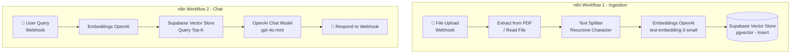

# 🧠 Lộ Trình Build RAG với n8n + Supabase + OpenAI

> [!IMPORTANT]
> RAG = **Retrieve** tài liệu liên quan → **Augment** prompt → **Generate** câu trả lời bằng LLM
> Toàn bộ pipeline được build bằng **n8n** (kéo thả, ít code), không cần tự viết ingestion/retrieval engine.

---

## 📐 Kiến Trúc Tổng Quan



---

## ⚙️ Phase 0: Chuẩn Bị Môi Trường

### 0.1 Khởi động n8n
```bash
# Trong thư mục BE
cd BE
docker compose up -d

# Truy cập n8n tại
http://localhost:5678
```

### 0.2 Enable pgvector trên Supabase
Vào **Supabase Dashboard → SQL Editor**, chạy:
```sql
-- Bật extension vector
create extension if not exists vector;

-- Bảng lưu documents (metadata)
create table documents (
  id uuid primary key default gen_random_uuid(),
  title text not null,
  file_type text,
  source_url text,
  created_at timestamptz default now(),
  metadata jsonb
);

-- Bảng lưu chunks + embeddings (n8n sẽ tự insert vào đây)
create table document_chunks (
  id uuid primary key default gen_random_uuid(),
  document_id uuid references documents(id) on delete cascade,
  content text not null,
  embedding vector(1536),
  metadata jsonb,
  created_at timestamptz default now()
);

-- HNSW Index để search nhanh
create index on document_chunks
using hnsw (embedding vector_cosine_ops)
with (m = 16, ef_construction = 64);
```

### 0.3 Tạo Credentials trong n8n
Vào **n8n → Settings → Credentials → Add Credential**:

| Credential | Thông tin cần điền |
|-----------|-------------------|
| **OpenAI** | API Key |
| **Supabase** | Project URL + Service Role Key |
| **HTTP Header Auth** | (để bảo vệ webhook nếu cần) |

**Checklist:**
- [ ] Docker n8n đang chạy tại `localhost:5678`
- [ ] pgvector đã enable trên Supabase
- [ ] Bảng `document_chunks` đã tạo
- [ ] Credentials OpenAI + Supabase đã add vào n8n

---

## Phase 1: Workflow Ingestion (Upload Tài Liệu)
> **Mục tiêu:** Nhận file → extract text → chunk → embed → lưu vào Supabase

### 🔧 Các Node cần kéo vào

```
[Webhook]
    ↓
[Extract from PDF] hoặc [Read Binary File]
    ↓
[Recursive Character Text Splitter]
    ↓
[Embeddings OpenAI]
    ↓
[Supabase Vector Store - Insert Documents]
    ↓
[Respond to Webhook] → { success: true }
```

### 📝 Cấu hình từng node

**Node 1: Webhook**
```
Method: POST
Path: /ingest-document
Response Mode: Using 'Respond to Webhook' node
```

**Node 2: Extract from PDF**
```
Operation: Extract Text
Input: Binary data từ Webhook
```
> Nếu file không phải PDF → dùng node **"Read/Write Files from Disk"** hoặc **"HTTP Request"** để fetch từ S3

**Node 3: Recursive Character Text Splitter**
```
Chunk Size: 500
Chunk Overlap: 50
```

**Node 4: Embeddings OpenAI**
```
Credential: (OpenAI đã tạo)
Model: text-embedding-3-small
```

**Node 5: Supabase Vector Store**
```
Operation: Insert Documents
Table Name: document_chunks
Query Name: content
Embedding: embedding
Metadata: { document_id, title, page, ... }
```

**Checklist:**
- [ ] Webhook nhận được file binary
- [ ] PDF extract ra text thành công
- [ ] Chunking hoạt động (kiểm tra output của Text Splitter)
- [ ] Embedding được generate
- [ ] Data xuất hiện trong bảng `document_chunks` trên Supabase

---

## Phase 2: Workflow Chat / Query (RAG)
> **Mục tiêu:** Nhận câu hỏi → tìm chunks liên quan → generate câu trả lời

### 🔧 Cách 1: Dùng AI Agent Node (Khuyến nghị)

```
[Webhook - nhận câu hỏi]
    ↓
[AI Agent]
  ├── Chat Model: OpenAI (gpt-4o-mini)
  ├── Memory: Window Buffer Memory (lưu lịch sử chat)
  └── Tool: Vector Store Retriever
              └── Supabase Vector Store (Query)
                      └── Embeddings OpenAI
    ↓
[Respond to Webhook] → { answer, sources }
```

### 📝 Cấu hình AI Agent Node

**Chat Model:**
```
Provider: OpenAI
Model: gpt-4o-mini
Temperature: 0.1
System Prompt: |
  Bạn là trợ lý AI thông minh. Chỉ trả lời dựa trên context được cung cấp.
  Nếu không tìm thấy thông tin, hãy nói "Tôi không tìm thấy thông tin này".
  Trích dẫn nguồn khi sử dụng. Trả lời bằng tiếng Việt.
```

**Memory:**
```
Type: Window Buffer Memory
Context Window: 10 (lưu 10 tin nhắn gần nhất)
Session Key: {{ $json.sessionId }} (theo từng user/session)
```

**Tool - Vector Store Retriever:**
```
Vector Store: Supabase
Table: document_chunks
Top K: 5
Similarity Threshold: 0.7
```

### 🔧 Cách 2: Manual Pipeline (Kiểm soát nhiều hơn)

```
[Webhook]
    ↓
[Embeddings OpenAI] ← embed câu hỏi
    ↓
[Supabase Vector Store - Query]
    ↓
[Set Node] ← format context từ chunks
    ↓
[OpenAI Chat Model] ← gửi prompt + context
    ↓
[Respond to Webhook]
```

**Checklist:**
- [ ] Webhook nhận `{ question, sessionId }`
- [ ] Vector Store trả về đúng chunks liên quan
- [ ] AI Agent/LLM trả lời bằng tiếng Việt
- [ ] Response bao gồm answer + sources
- [ ] Memory giữ được lịch sử chat theo session

---

## Phase 3: Kết Nối với Next.js Backend

### API call từ BE sang n8n

```typescript
// BE/src/services/rag.service.ts

// Ingest document
async function ingestDocument(fileBuffer: Buffer, metadata: object) {
  const formData = new FormData()
  formData.append('file', new Blob([fileBuffer]), 'document.pdf')
  formData.append('metadata', JSON.stringify(metadata))

  const response = await fetch('http://localhost:5678/webhook/ingest-document', {
    method: 'POST',
    body: formData,
  })
  return response.json()
}

// Chat với RAG
async function chatWithRAG(question: string, sessionId: string) {
  const response = await fetch('http://localhost:5678/webhook/rag-chat', {
    method: 'POST',
    headers: { 'Content-Type': 'application/json' },
    body: JSON.stringify({ question, sessionId }),
  })
  return response.json()
}
```

### Endpoints BE cần build

```typescript
POST /api/documents/upload   → gọi n8n webhook ingest
POST /api/chat               → gọi n8n webhook chat
GET  /api/chat/history       → lấy từ DB (tự quản lý)
```

**Checklist:**
- [ ] n8n webhook URL đúng
- [ ] BE gọi được n8n (không bị CORS/network block)
- [ ] File được truyền đúng dạng binary sang n8n
- [ ] Response từ n8n được parse và trả về FE

---

## Phase 4: Các Workflow Nâng Cao trong n8n

### 4.1 Workflow xử lý file từ S3
```
[Webhook nhận S3 URL]
    ↓
[HTTP Request] ← download file từ S3
    ↓
[Extract from PDF]
    ↓
... (tiếp tục pipeline ingestion)
```

### 4.2 Workflow xử lý batch nhiều file
```
[Schedule Trigger / Manual Trigger]
    ↓
[Supabase - Get pending documents]
    ↓
[Loop Over Items]
    ↓
[HTTP Request - download from S3]
    ↓
[Extract + Chunk + Embed + Store]
    ↓
[Supabase - Update status = 'done']
```

### 4.3 Webhook bảo mật
```
[Webhook]
  └── Header Auth: x-api-key: {{ $env.N8N_WEBHOOK_SECRET }}
```
Trong BE:
```typescript
headers: { 'x-api-key': process.env.N8N_WEBHOOK_SECRET }
```

---

## Phase 5: Monitoring & Debug trong n8n

| Tính năng | Cách dùng |
|-----------|-----------|
| **Execution Log** | n8n → Executions → xem từng lần chạy |
| **Test Workflow** | Click "Test Workflow" để chạy thử với data mẫu |
| **Error Workflow** | Setup workflow riêng để handle lỗi, gửi alert |
| **Pinned Data** | Pin data ở từng node để debug không cần chạy lại |

**Checklist:**
- [ ] Bật "Save Successful Executions" để review log
- [ ] Setup Error Workflow → gửi email/Slack khi lỗi
- [ ] Test từng node riêng trước khi chạy full workflow

---

## 🛠️ Tech Stack Thực Tế

| Layer | Technology |
|-------|-----------|
| **Workflow Engine** | n8n (Docker, localhost:5678) |
| **Vector DB** | Supabase + pgvector |
| **Embedding** | OpenAI text-embedding-3-small |
| **LLM** | GPT-4o-mini |
| **File Storage** | AWS S3 |
| **Backend** | Next.js (gọi n8n webhook) |
| **File Parsing** | n8n built-in PDF extractor |

---

## 📅 Timeline

| Tuần | Milestone |
|------|-----------|
| **Week 1** | Phase 0: Setup n8n + Supabase pgvector + Credentials |
| **Week 1** | Phase 1: Workflow Ingestion hoạt động end-to-end |
| **Week 2** | Phase 2: Workflow Chat/RAG, test câu hỏi thực tế |
| **Week 2** | Phase 3: Kết nối Next.js BE ↔ n8n webhook |
| **Week 3** | Phase 4: Xử lý S3, batch, bảo mật webhook |
| **Week 3+** | Phase 5: Monitor, fix bugs, optimize chunk size |

---

> [!TIP]
> Vào **n8n Templates** (menu trái) → search **"RAG"** hoặc **"Vector Store"** → import template có sẵn, chỉnh sửa cho phù hợp. Tiết kiệm rất nhiều thời gian!

> [!NOTE]
> n8n đã tích hợp sẵn: Supabase Vector Store, OpenAI Embeddings, AI Agent, Text Splitter — không cần cài thêm gì.

> [!WARNING]
> Khi deploy production, đổi n8n webhook URL từ `localhost:5678` sang domain thật và nhớ bật **Header Auth** để bảo vệ webhook.
