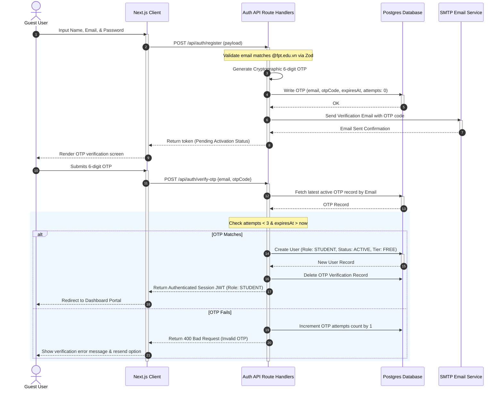
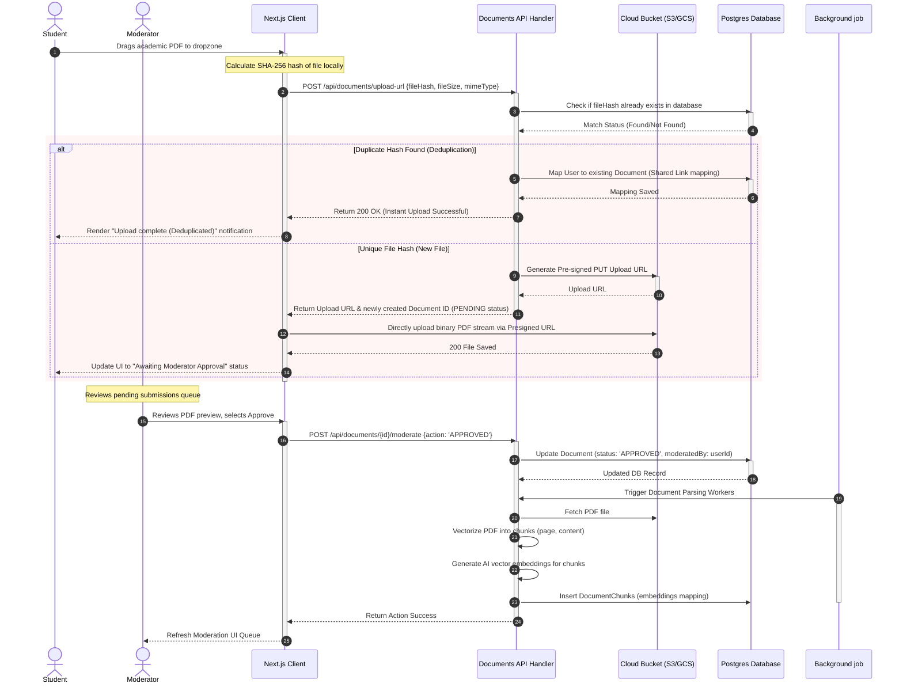
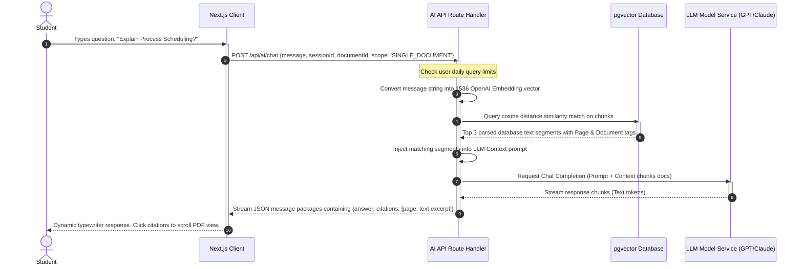
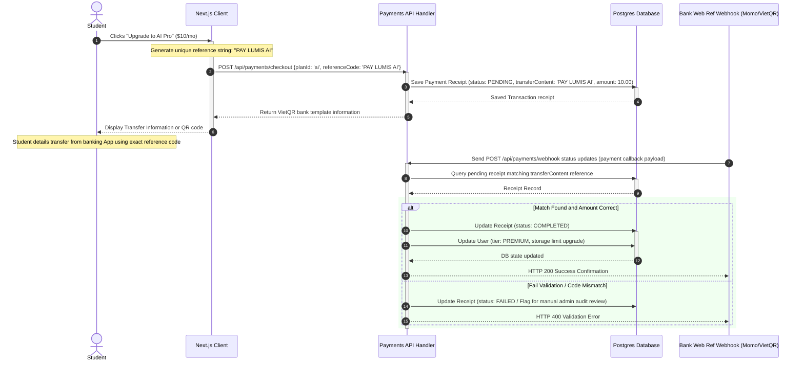

# Backend Service Sequence Diagrams
## Project: Lumis (Academic Document Management & AI Synthesis Platform)

This document contains UML sequence diagrams detailing transaction patterns, client interactions, service layers, and database states.

---

## 1. User Registration & Email OTP Verification

This flow describes authentication verification when a Guest creates a student account.

---

## 2. Document Upload, Deduplication, & Moderation Lifecycle

Manages metadata calculation, client-side direct S3/Cloud Storage upload, content deduplication matching, and approval queue processing.

---

## 3. RAG Semantic Search & Citation-Referenced AI Chat

Demonstrates how user chats are processed, contextualized with document vector embeddings, and streamed back with citations.

---

## 4. Payment Receipt & Subscription Upgrades

Models secure transactions through manual bank transfer QR patterns and administrative automated confirmations.

